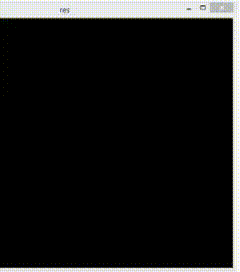

# CMU and UIUC internship opportunity

These are the two projects that i want to describe for internship opportunity with faculties at CMU and UIUC. Follow are the title for the two projects.  
  - Labelling images as 'cat and 'not_cat'
  - Tracking hand movement using OpenCV

## Labelling images as 'cat' and 'not_cat'

  - It is a classic example of a binary classification.
  - Binary classification model is tranined using Deep Neural Networks(DNNs)

The accuracy for 2 layer network was 99.99% on training data and 70% on testing data. And the accuracy for 5 layer network was 98.5% on training data and 80% on testing data.
A deep neural network (DNN) is an artificial neural network (ANN) with multiple layers between the input and output layers.
The following image shows the neural network architecture for binary classification. 
Input layer consists of Xm neurons and output layer consist of two neuron. 

## Tracking real-time hand movement using OpenCV. 
- The tracking of real time hand-movement can be done using OpenCV (Computer Vision).
- Tracking of object has various applications in different fileds of study.

 Video tracking is the process of locating a moving object (or multiple objects) over time using a camera. It has a variety of uses, some of which are: human-computer interaction, security and surveillance, video communication and compression, augmented reality, traffic control, medical imaging and video editing.
 